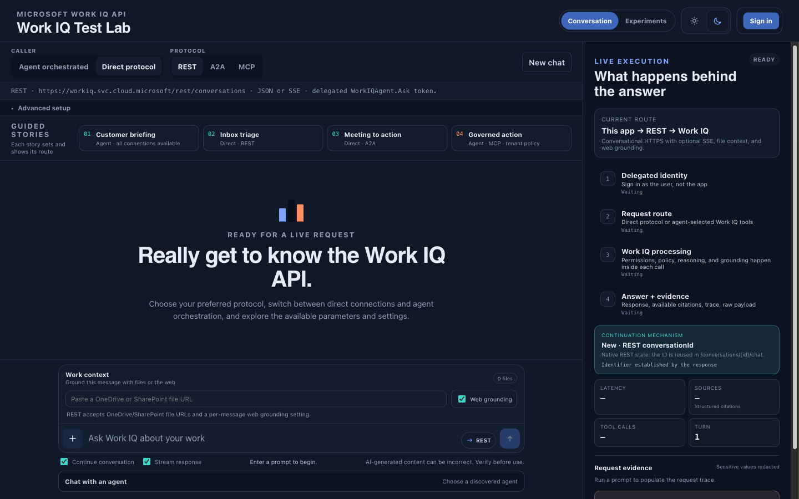
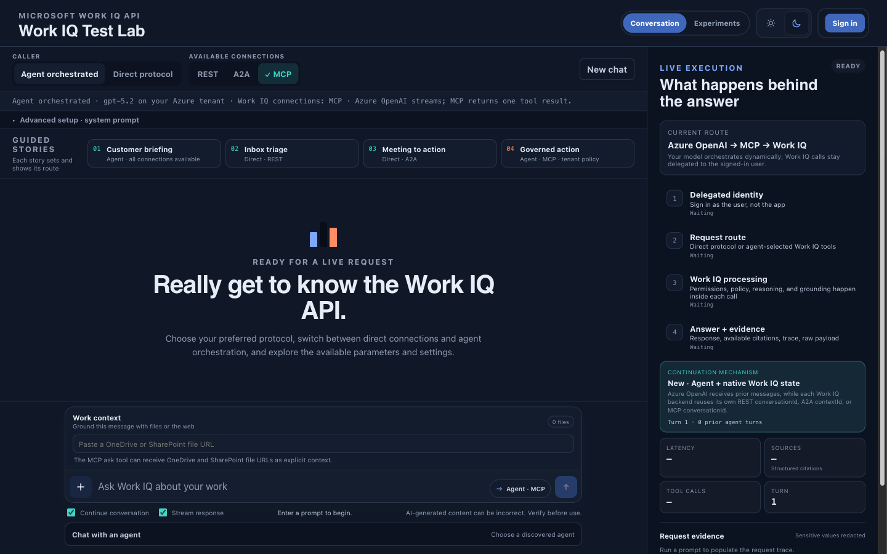
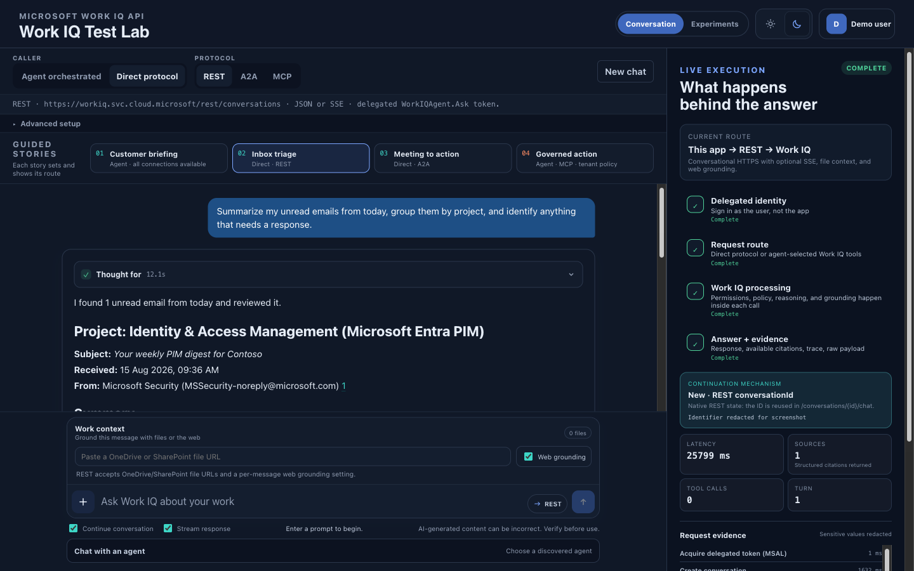
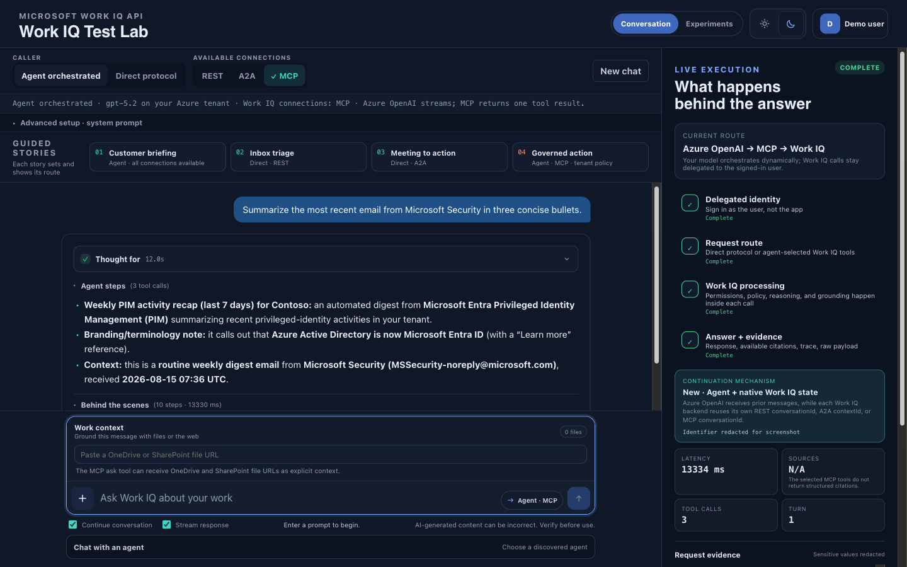
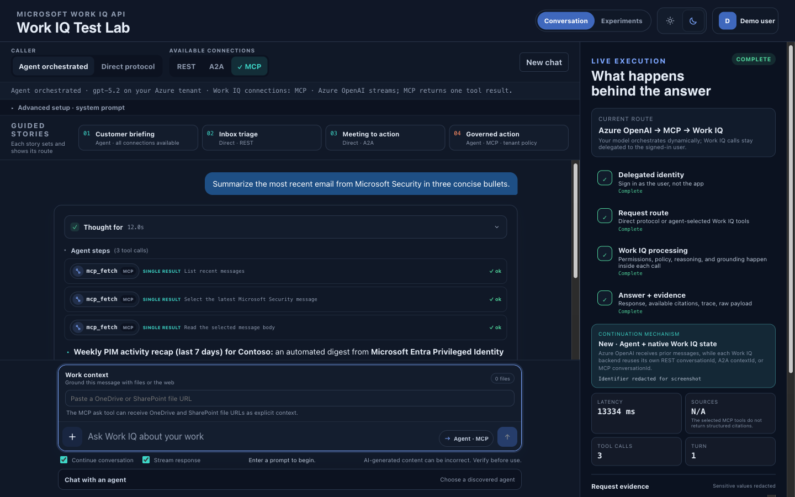
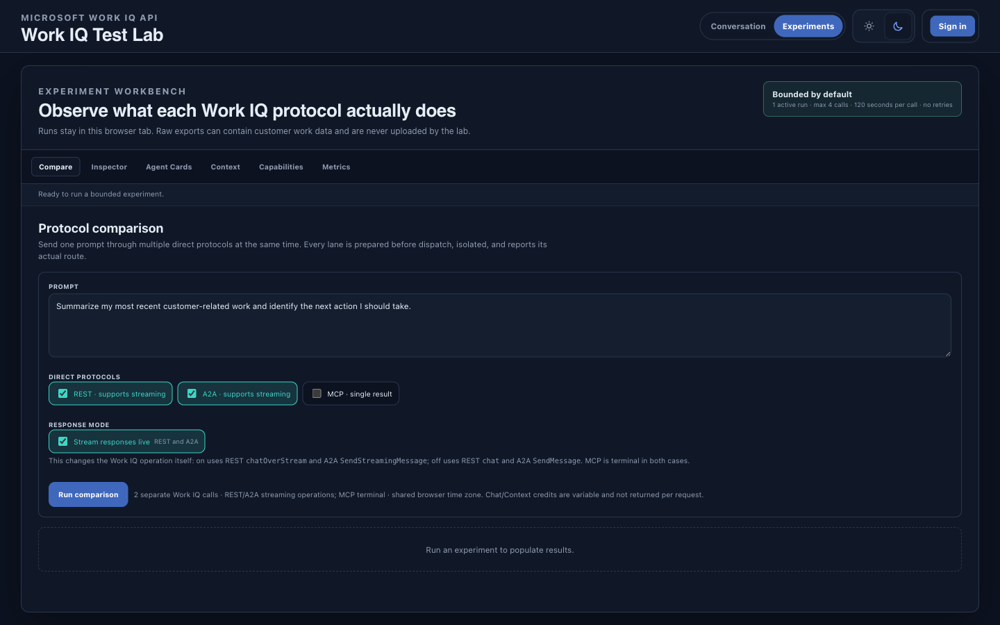

# Work IQ Test Lab

A browser-based lab for testing Microsoft Work IQ API through REST API, A2A, and MCP.
It includes four guided use cases, protocol inspection, context experiments,
delegated Microsoft Entra sign-in, and optional Azure OpenAI orchestration (to simulate your own agent/orchestrator leveraging Work IQ API).
Two stories use direct Work IQ protocols and work without Azure OpenAI; the two
agent-orchestrated stories require it.

## Disclaimer

This is an independent, community-provided sample project. It is not an official
Microsoft product, solution, repository, or reference implementation, and is not
endorsed, supported, or maintained by Microsoft.

This project is provided solely for learning, discovery, demonstration, and
experimentation with the Work IQ APIs. It is provided **"as is"** and
**"as available,"** without warranties or guarantees of any kind.

You are responsible for validating the project before use and for your tenant
configuration, permissions, security controls, data handling, compliance
obligations, and service costs. APIs, features, licensing, and requirements may
change without notice.

To the maximum extent permitted by applicable law, the maintainers and
contributors accept no liability for any loss or damage arising from the use of,
or inability to use, this project. No support, maintenance, or update commitment
is provided.

Microsoft, Microsoft 365, Azure, Work IQ, and related names may be trademarks of
Microsoft Corporation. Their use does not imply affiliation or endorsement.

## See it in action

### Live lab and guided stories

| Direct Work IQ protocols | Azure OpenAI orchestration |
| --- | --- |
|  |  |

Choose direct REST, A2A, or MCP calls, or let an Azure OpenAI model orchestrate
the available Work IQ connections. The execution rail shows routing,
continuation, evidence, and timing without exposing credentials.

### Completed requests

| Direct REST result | Agent-orchestrated MCP result |
| --- | --- |
|  |  |

These examples use non-confidential demo-tenant content. The displayed identity
and continuation identifiers are replaced with demo-safe labels.

#### MCP multi-call trace



The expanded agent steps show how one orchestrated answer can use several bounded
MCP calls. Request and response payloads remain hidden while the tool, purpose,
delivery mode, and status of each call stay visible.

### Bounded protocol experiments



Compare isolated protocol lanes behind one dispatch barrier, inspect raw events,
review Agent Cards, test context variants and capabilities, and separate setup
time from response timing.

## Start here

New tenant setup is documented in
[docs/tenant-setup.md](docs/tenant-setup.md). The guide includes:

- Prerequisites and Work IQ billing.
- A least-privilege administrator role matrix.
- A recommended manual setup path.
- A dry-run-first scripted alternative.
- Local and hosted deployment instructions.
- Verification, troubleshooting, rotation, and retirement steps.

The manual path uses less privilege. The scripted path requires temporary Global
Administrator because Azure CLI's `az ad app permission admin-consent` command
requires that role. The application itself never runs with an administrator
account or application-only Work IQ access. Work IQ API only works through delegated permissions (because it acts on behalf of the end user, just like Microsoft 365 Copilot).

## Local run

Requirements:

- Node.js 20 or later.
- OpenSSL.
- A configured tenant and Entra app from the setup guide.
- A downloaded or cloned copy of this release, with the shell in its repository
  root (the folder containing `package.json`).

```bash
npm ci
umask 077
cp .env.example .env
chmod 600 .env
openssl rand -hex 32
# Replace every placeholder in .env. Use the command output for SESSION_SECRET.
npm run config:verify
npm start
```

Open the origin configured in `REDIRECT_URI`, normally
`http://localhost:3000`.

The configuration validator rejects placeholder values, unsafe URLs, weak session secrets, remote
identity fallback, and configuration files readable by other users.

## What the lab contains

| Area | Purpose |
| --- | --- |
| Guided stories | Customer briefing, inbox triage, meeting-to-action, and governed-action flows |
| Direct protocols | Delegated REST, A2A, and MCP calls, so you can test the results for your prompts |
| Experiments | Protocol comparison, raw event inspection, live MCP tool discovery, Agent Cards, context variants, capabilities, and lifecycle timing |
| Optional LLM orchestration | LLM via Azure OpenAI selects and combines enabled Work IQ connections, with a customizable system prompt |
| Execution rail | Redacted routing, lifecycle, evidence, and continuation details |

Streaming is end to end where the protocol supports it:

- REST streaming uses `chatOverStream`; terminal REST uses `chat`.
- A2A streaming uses `SendStreamingMessage`; terminal A2A uses `SendMessage`.
- MCP `ask` returns one terminal tool result.

The live execution panel is separate from answer streaming. It updates while
authentication, protocol setup, Work IQ calls, parsing, and agent tool calls are
running, even when the answer itself is terminal. Its trace events contain only
operation names, state, timing, protocol kind, and HTTP status. Tokens, URLs,
headers, request bodies, response bodies, tenant IDs, and conversation IDs are
not sent in those events.

### How direct MCP works

Direct MCP does not use Azure OpenAI or the customizable orchestrator system
prompt. The app connects to the configured Work IQ MCP server, discovers its
current tool schema, and invokes one `ask` tool with:

- the user's prompt;
- `agentId`, when selected and supported by the discovered schema;
- OneDrive or SharePoint `fileUrls`, when supplied and supported;
- the previous MCP `conversationId`, when continuation is enabled and supported;
- the browser time zone, when supported.

The selected Work IQ agent and the Work IQ service own the instructions,
reasoning, grounding, and any internal actions behind that `ask`. Remote MCP
uses the signed-in user's delegated `WorkIQAgent.Ask` token and therefore cannot
exceed that user's Microsoft 365 access, tenant policy, or the selected agent's
capabilities. The scope can authorize reads and writes, but writes still require
the corresponding Work IQ MCP mutation policy; this direct lab route itself
chooses only `ask`, not a raw mutation tool.

The app can show its own MCP connection, discovery, and `ask` lifecycle. It
cannot stream the terminal MCP answer, expose hidden Work IQ reasoning or
internal tool calls, apply the REST-only web-grounding toggle, or combine
multiple protocols without switching to Azure OpenAI orchestration.

### How Agent orchestration uses Work Context

When OneDrive or SharePoint URLs are attached in Agent mode, the app tells the
orchestrator how many files are attached but withholds the URL values from Azure
OpenAI. The system prompt requires the orchestrator to choose REST ask or MCP
ask with `fileUrls` support and explicitly ask Work IQ to inspect the attached
files when that context is relevant to the request. The attachment does not
force a tool call for an unrelated request. When the orchestrator selects a
compatible tool, the server replaces any model-generated file argument with the
validated URLs and injects them into the Work IQ call as REST
`contextualResources` or MCP `fileUrls`.

A2A and raw MCP entity tools do not receive attached URLs in this app. If no
compatible REST or MCP ask tool is available, the request fails explicitly
instead of answering without the selected files. Retrieved file content is
treated as untrusted evidence, never as instructions for the orchestrator.

The comparison tool in 'experiments' prepares REST conversations and MCP clients before releasing
one shared prompt-dispatch barrier. It reports setup, barrier wait, first
response, delivery, prompt-to-complete, and end-to-end timing separately.
Streaming and terminal calls are different Work IQ operations, so compare
time-to-first-response and total time as different measurements.

## Required configuration

```dotenv
ENTRA_TENANT_ID=<tenant-uuid>
ENTRA_CLIENT_ID=<application-client-uuid>
ENTRA_CLIENT_SECRET=<client-secret-value>
REDIRECT_URI=http://localhost:3000/auth/callback
SESSION_SECRET=<at-least-32-random-bytes>
PORT=3000
HOST=127.0.0.1
WORKIQ_MCP_TRANSPORT=remote
WORKIQ_MCP_REMOTE_FALLBACK=off
```

Optional Azure OpenAI orchestration uses `DefaultAzureCredential`, not an API
key. These values are Azure **deployment names**, which can differ from the
underlying model names:

```dotenv
AZURE_OPENAI_ENDPOINT=https://<resource>.openai.azure.com/
AZURE_OPENAI_DEPLOYMENT=<default-deployment-name>
AZURE_OPENAI_DEPLOYMENTS=<default-deployment-name>,<another-deployment-name>
AZURE_OPENAI_API_VERSION=2024-10-21
```

See [docs/tenant-setup.md](docs/tenant-setup.md#optional-azure-openai-orchestration)
for resource, model deployment, network, and identity setup. Local operation can
use either the operator's Azure CLI identity or a separate resource-scoped
service principal; Azure hosting should use managed identity. Validate
configuration without printing secret values, then make one small tool-calling
request per configured deployment:

```bash
npm run config:verify
npm run azure-openai:verify
```

If the tenant setup script generated a configuration file, validate it before
installing it:

```bash
node scripts/verify-config.mjs --env .env.generated
```

## Security boundaries

- Work IQ access is delegated-only and limited to the signed-in user's existing
  Microsoft 365 permissions, labels, compliance controls, and tenant policy.
- The Entra app requests only delegated `WorkIQAgent.Ask`.
- That scope can authorize both read and write operations; Work IQ tenant policy
  controls which MCP paths and methods are allowed.
- Enterprise-app assignment should be restricted to the approved lab group.
- Client secrets, session secrets, bearer tokens, and the MSAL cache stay on the
  server.
- Session files are owner-only.
- The server listens on loopback unless remote binding is explicitly enabled.
- Hosted deployments require HTTPS at a trusted reverse proxy; the Node listener
  must not be directly internet-accessible.
- Remote MCP never falls back to a local CLI identity.
- MCP mutations are governed by Work IQ tenant policy (configured in the
  Microsoft 365 admin center under **Agents > Tools > Work IQ MCP > Policies**).
- Exported experiment JSON can contain tenant work data. Review it before
  sharing.

Report suspected vulnerabilities through a private GitHub security advisory as
described in [SECURITY.md](SECURITY.md).

## Repository layout

```text
docs/tenant-setup.md          Manual and scripted tenant setup
scripts/setup-tenant.sh       Dry-run-first tenant automation
scripts/verify-config.mjs     Secret-safe configuration validation
src/server.js                 Express routes and session handling
src/auth.js                   Entra authorization code + PKCE
src/adapters/                 REST, A2A, MCP, and Azure OpenAI adapters
src/experiments/              Bounded comparison coordinator
public/                       Browser application
```
